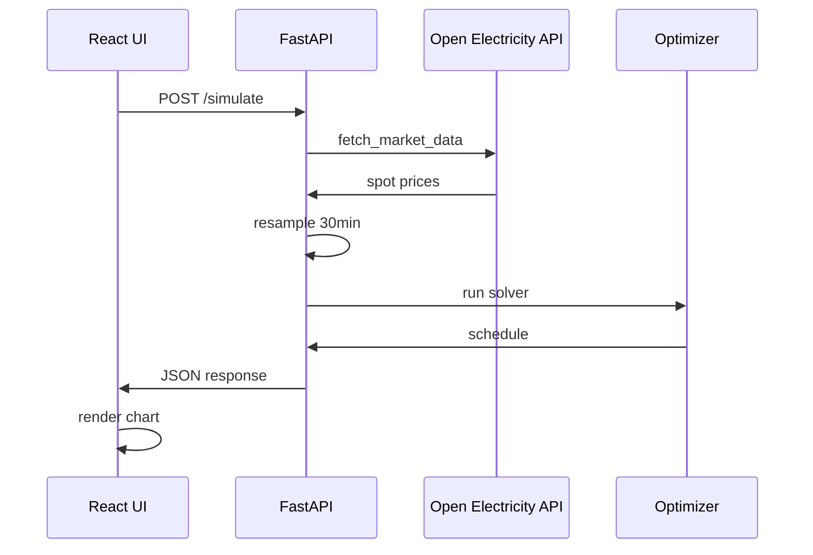

# Battery Dispatch Optimizer

This project computes optimal battery charge/discharge schedules for energy arbitrage using linear programming (PuLP), a FastAPI backend, and a React + Tailwind CSS frontend. It fetches live spot price data from AEMO (Australian Energy Market Operator) via the Open Electricity API.

## System Flow (End-to-End)

### Diagram

### Diagram Explanation
            
1. You configure **Battery Capacity** and **Max Power Output** in the UI.
2. You click **Run Optimization** in the React app.
3. The frontend sends a POST request to the FastAPI server at `/simulate`.
4. The FastAPI server calls `run_live_simulation()` in [main.py](main.py).
5. The backend fetches live market data from AEMO via the Open Electricity API.
6. The data is resampled to 30-minute intervals and passed to the optimization engine.
7. The PuLP solver in `calculate_optimal_dispatch()` computes the optimal schedule.
8. The backend returns the schedule, total profit, and status to the frontend.
9. The React app renders the dispatch schedule chart with State of Charge and Spot Price.

## Core Algorithms

### 1) Linear Programming Formulation (PuLP)

We formulate battery dispatch as a linear programming problem where the objective is to maximize arbitrage profit over a 24-hour horizon (48 x 30-minute intervals).

**Decision Variables:**
- $charge_t$: Charging power at time $t$ (MW)
- $discharge_t$: Discharging power at time $t$ (MW)
- $soc_t$: State of Charge at time $t$ (MWh)

**Objective Function:**

$$
\max \sum_{t=1}^{T} (discharge_t - charge_t) \cdot price_t \cdot \Delta t
$$

Where $\Delta t = 0.5$ hours (30 minutes).

**Constraints:**

1. **Power limits:** $0 \leq charge_t \leq max\_mw$, $0 \leq discharge_t \leq max\_mw$
2. **Capacity limits:** $0 \leq soc_t \leq capacity\_mwh$
3. **Energy balance:** 
   $$soc_t = soc_{t-1} + (charge_t \cdot \eta - discharge_t) \cdot \Delta t$$
4. **Initial condition:** $soc_0 = 0$ (empty battery)

Where $\eta = 0.9$ is the round-trip efficiency.

Implementation: [main.py](main.py) - `calculate_optimal_dispatch()`

### 2) Market Data Processing

Live spot prices are fetched from AEMO via the Open Electricity API:

1. Query 5-minute price data for the last 24 hours
2. Resample to 30-minute intervals using mean aggregation
3. Take the most recent 48 periods (24 hours)
4. Format as `MarketInterval` objects for the optimizer

Implementation: [main.py](main.py) - `run_live_simulation()`

## Current Limitations

### Single Market Region

Currently only supports **SA1** (South Australia) region. The optimization does not account for:
- Multiple region arbitrage
- Network constraints or transmission losses
- FCAS (Frequency Control Ancillary Services) revenue

<!-- ### Fixed Efficiency Model

The round-trip efficiency is hardcoded at 90%. In reality, efficiency varies with:
- Charge/discharge rate (C-rate)
- Temperature
- Battery age (degradation)

### Perfect Foresight

The optimizer assumes **perfect knowledge** of future prices. In practice, you would need:
- Price forecasting models
- Stochastic or robust optimization
- Model Predictive Control (MPC) for rolling horizon

### Why Stochastic Optimization Is Needed

For production battery dispatch, prices are uncertain. The standard approach is **Stochastic Programming** or **MPC**:

1. Generate price scenarios from historical data or forecasting models
2. Solve multi-stage stochastic program:
   $$\max \mathbb{E}[\sum_t profit_t]$$
3. Or use MPC: solve deterministic problem with predicted prices, implement first action, repeat

This accounts for uncertainty and provides robust schedules that adapt to actual price realizations. -->

## Project Files (Key Pieces)

- **FastAPI backend:** [main.py](main.py)
- **Optimization engine:** [optimizer.py](optimizer.py)
- **Data pipeline:** [pipeline.py](pipeline.py)
- **React frontend:** [frontend/src/App.tsx](frontend/src/App.tsx)
- **Frontend styles:** [frontend/src/index.css](frontend/src/index.css)
- **Data generator:** [generate_data.py](generate_data.py)

## Deployment

- **Backend:** Deployed on [Render] [1]
- **Frontend:** Deployed on [S3 + CloudFront] [2]

CI/CD pipelines were created for both frontend and backend deployments via GitHub Actions.

## References

[1] Render - [https://battery-dispatch-optimization.onrender.com](https://battery-dispatch-optimization.onrender.com)

[2] CloudFront - [https://d2zg9d8ixwrq14.cloudfront.net](https://d2zg9d8ixwrq14.cloudfront.net)

3. FastAPI [tutorial](https://code.visualstudio.com/docs/python/tutorial-fastapi) in VSCode.
4. [Preventing](https://www.reddit.com/r/ClaudeAI/comments/1qfsbem/claude_code_reading_env_file_or_any_fix_7_months/) agents from reading .env or other confidential files
5. Open Electricity [Platform](https://openelectricity.org.au/about)
6. The Superpower Institute [webpage](https://preview.superpowerinstitute.com.au/)
7. Open Electricity [API](https://docs.openelectricity.org.au/api-reference/overview)
8. PuLP Documentation - [Optimization with PuLP](https://coin-or.github.io/pulp/)
