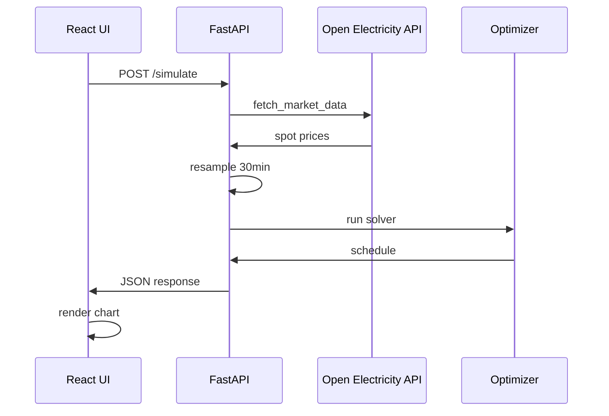

# Battery Dispatch Optimizer

This project computes optimal battery charge/discharge schedules for energy arbitrage using linear programming (PuLP), a FastAPI backend, and a React + Tailwind CSS frontend. It fetches live spot price data from AEMO (Australian Energy Market Operator) via the Open Electricity API.

## System Flow (End-to-End)

### Diagram

```mermaid
sequenceDiagram
    participant UI as React UI
        participant API as FastAPI
    participant OE as Open Electricity API
        participant SOLVER as Optimizer
            
            UI->>API: POST /simulate
    API->>OE: fetch_market_data
    OE->>API: spot prices
    API->>API: resample 30min
    API->>SOLVER: run solver
    SOLVER->>API: schedule
    API->>UI: JSON response
    UI->>UI: render chart
```
### Diagram Explanation
            
1. You configure **Battery Capacity** and **Max Power Output** in the UI.
2. You click **Run Optimization** in the React app.
3. The frontend sends a POST request to the FastAPI server at `/simulate`.
4. The FastAPI server calls `run_live_simulation()` in [main.py](main.py).
5. The backend fetches live market data from AEMO via the Open Electricity API.
6. The data is resampled to 30-minute intervals and passed to the optimization engine.
7. The PuLP solver in `calculate_optimal_dispatch()` computes the optimal schedule.
8. The backend returns the schedule, total profit, and status to the frontend.
9. The React app renders the dispatch schedule chart with State of Charge and Spot Price.

## Key Concepts

- **Grid:** the electricity network. The battery can pull power from it or push power into it.
- **Battery / Energy Storage System:** a device that stores electricity. It does **not** generate electricity. A solar panel generates electricity; a battery only stores it.
- **Charge:** pulling electricity from the grid into the battery.
- **Discharge:** pushing electricity from the battery into the grid.
- **State of Charge (SoC):** the amount of energy currently stored in the battery, measured in MWh.
- **Spot price:** the wholesale market price of electricity at a specific time, measured in AUD/MWh. In this project prices come from AEMO (Australian Energy Market Operator) via the Open Electricity API.
- **MW (megawatt):** a unit of power — the *rate* at which electricity moves.
- **MWh (megawatt-hour):** a unit of energy — the *total amount* of electricity moved. `MWh = MW × hours`.
<!-- 
See the visual diagrams in `images/`:
- [`images/battery_vs_solar.svg`](images/battery_vs_solar.svg)
- [`images/system_architecture.svg`](images/system_architecture.svg)
- [`images/arbitrage_cycle.svg`](images/arbitrage_cycle.svg)
- [`images/formula_notation.svg`](images/formula_notation.svg) -->

## Core Algorithms

### 1) Linear Programming Formulation (PuLP)

We formulate battery dispatch as a linear programming problem where the objective is to maximize arbitrage profit over a 24-hour horizon ($48 \times 30$-minute intervals). Intervals are indexed $t = 0, 1, \dots, T-1$ to match the Python code.

**Parameters (given):**

| Symbol | Meaning | Unit |
|---|---|---|
| $C$ | battery capacity | MWh |
| $P$ | max charge/discharge power | MW |
| $\eta$ | charging efficiency | unitless |
| $\Delta t$ | length of one interval | 0.5 hours |
| $T$ | number of intervals | 48 |

**Decision variables (chosen by the solver):**

| Symbol | Meaning | Unit |
|---|---|---|
| $c(t)$ | charging power at interval $t$ | MW |
| $d(t)$ | discharging power at interval $t$ | MW |
| $s(t)$ | state of charge at interval $t$ | MWh |

**Market data (fetched from AEMO):**

| Symbol | Meaning | Unit |
|---|---|---|
| $p(t)$ | spot price at interval $t$ | AUD/MWh |

**Objective function:**

Maximize total profit $\Pi$ over the 24-hour horizon:

$$
\max \Pi = \sum_{t=0}^{T-1} \big( d(t) - c(t) \big) \cdot p(t) \cdot \Delta t
$$

Each term $\big( d(t) - c(t) \big) \cdot \Delta t$ is the net energy sold (in MWh) during interval $t$. Multiplying by $p(t)$ gives the profit or cost for that interval in AUD.

**Constraints:**

1. **Power limits:** $0 \leq c(t) \leq P$, $0 \leq d(t) \leq P$ for all $t = 0, \dots, T-1$
2. **Capacity limits:** $0 \leq s(t) \leq C$ for all $t = 0, \dots, T-1$
3. **Energy balance:**
   - First interval (battery starts empty):  
     $$s(0) = \big( \eta \cdot c(0) - d(0) \big) \cdot \Delta t$$
   - Subsequent intervals:  
     $$s(t) = s(t-1) + \big( \eta \cdot c(t) - d(t) \big) \cdot \Delta t \quad \text{for } t = 1, \dots, T-1$$

The efficiency $\eta$ means only a fraction of purchased energy actually enters storage; the rest is lost.

Implementation: [main.py](main.py) - `calculate_optimal_dispatch()`

### 2) Market Data Processing

Live spot prices are fetched from AEMO via the Open Electricity API:

1. Query 5-minute price data for the last 24 hours
2. Resample to 30-minute intervals using mean aggregation
3. Take the most recent 48 periods (24 hours)
4. Format as `MarketInterval` objects for the optimizer

Implementation: [main.py](main.py) - `run_live_simulation()`

## Current Limitations

### Single Market Region

Currently only supports **SA1** (South Australia) region. The optimization does not account for:
- Multiple region arbitrage
- Network constraints or transmission losses
- FCAS (Frequency Control Ancillary Services) revenue

<!-- ### Fixed Efficiency Model

The round-trip efficiency is hardcoded at 90%. In reality, efficiency varies with:
- Charge/discharge rate (C-rate)
- Temperature
- Battery age (degradation)

### Perfect Foresight

The optimizer assumes **perfect knowledge** of future prices. In practice, you would need:
- Price forecasting models
- Stochastic or robust optimization
- Model Predictive Control (MPC) for rolling horizon

### Why Stochastic Optimization Is Needed

For production battery dispatch, prices are uncertain. The standard approach is **Stochastic Programming** or **MPC**:

1. Generate price scenarios from historical data or forecasting models
2. Solve multi-stage stochastic program:
   $$\max \mathbb{E}[\sum_t profit_t]$$
3. Or use MPC: solve deterministic problem with predicted prices, implement first action, repeat

This accounts for uncertainty and provides robust schedules that adapt to actual price realizations. -->

## Project Files (Key Pieces)

- **FastAPI backend:** [main.py](main.py)
- **Optimization engine:** [optimizer.py](optimizer.py)
- **Data pipeline:** [pipeline.py](pipeline.py)
- **React frontend:** [frontend/src/App.tsx](frontend/src/App.tsx)
- **Frontend styles:** [frontend/src/index.css](frontend/src/index.css)
- **Data generator:** [generate_data.py](generate_data.py)

## Deployment

- **Backend:** Deployed on [Render] [1]
- **Frontend:** Deployed on [S3 + CloudFront] [2]

CI/CD pipelines were created for both frontend and backend deployments via GitHub Actions.

## References

1. CloudFront - [https://d2zg9d8ixwrq14.cloudfront.net](https://d2zg9d8ixwrq14.cloudfront.net)
2. FastAPI [tutorial](https://code.visualstudio.com/docs/python/tutorial-fastapi) in VSCode.
3. [Preventing](https://www.reddit.com/r/ClaudeAI/comments/1qfsbem/claude_code_reading_env_file_or_any_fix_7_months/) agents from reading .env or other confidential files
4. Open Electricity [Platform](https://openelectricity.org.au/about)
5. The Superpower Institute [webpage](https://preview.superpowerinstitute.com.au/)
6. Open Electricity [API](https://docs.openelectricity.org.au/api-reference/overview)
7. PuLP Documentation - [Optimization with PuLP](https://coin-or.github.io/pulp/)
